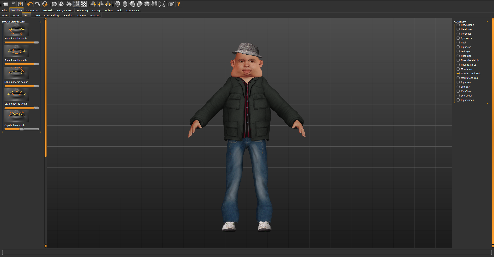

<!-- TABLE OF CONTENTS -->
  
Table of Contents

  <ol>
    <li><a href="#introduction">Introduction</a></li>
    <li><a href="#project-tasks">Project Tasks</a>
	<ul>
            <li><a href="#character-creation">Character Creation</a></li>
            <li><a href="#character-rigging">Character Rigging</a></li>
	    <li><a href="#animation-creation">Animation Creation</a></li>
            <li><a href="#unity-import">Unity Import</a></li>
	    <li><a href="#animation-state-machine">Animation State Machine</a></li>
            <li><a href="#blend-tree">Blend Tree</a></li>
            <li><a href="#meta-channels">Meta Channels</a></li>
            <li><a href="#ragdoll">Ragdoll</a></li>
        </ul>
    </li>
    <li><a href="#Demo">Demo</a></li>
  </ol>

<!-- Introduction -->
## Introduction

The objectives of this project is to create an interactive animation demo using the tools in Unity as well as Blender. In this report I will detail the step by step work involved.

<!-- Project Tasks -->
## Project Tasks
### Character Creation

I created my character using MakeHuman. MakeHuman is a free open source software that enables you to customise a humanoid character. In order to do this you must select the feature on your character that you want to customise, and use the slider to modify that feature. MakeHuman also allows you to select what clothes you want the character to wear  
One I finished creating my character I exported it as a .stl and imported it into blender.

### Character Rigging

I used Rigify to generate a humanoid armature, and then manually scaled and moved the bones from this armature into the correct positions inside my mesh.  

Once I was happy with the placement of the armature I used the automatic weight paint option in blender to attach the armature to the mesh. I then had to use the weight paint tool to manually correct some vertex weighting problems that occured after the automatic weight painting. The main vertex weighting problems I encountered was that the eyes and teeth didn't connect to the characters head correctly.

To make animations easier I added IK solvers onto my Armature in blender. This enabled me to move the characters leg by dragging 1 bone on the characters foot, rather than individually moving the thigh, shin and feet bones. It also made sure that the knee joint could only bend the correct way. This simplified the animation process.

### Animation Creation

I made a number of animations for this project (walkforward, walkbackwards, stafeleft, staferight, wave, kick, block)  
To make animations, you have to move the character into set positions and save it as a keyframe in the animation timeline in blender. Continue saving different poses every so many frames until you make a full action.

Examples of two of my animations for walking forward and strafing left:

### Unity Import

Export the character from blender as a .fbx and import into unity. To test the mapping I used a free animation I found on the unity store on my character.

### Animation State Machine

In order to use different animations on my character at seperate times I created an animation state machine.  
The first state is a blend tree involving the idle and 4 walk animations. The character can transition from the walkcycle into the wave, block or kick state and then back to the walkcycle. 

### Blend Tree

Blend trees allow you to blend different animations together, I used a blend tree for my walk cycle involving the idle, walkforward, walkback, stafeleft and staferight animations.   
The parameters I used are x and y for the direction the character is moving in.

the image above shows what animation plays depending on the movement of the character. if the character isnt moving idle plays, if the character moves forward then walkforward animation plays. but if the character moves forward and to the left then the forward and stafeleft animations are blended together.

### Meta Channels

### Ragdoll

### Demo

end result of some of my animations and my character in unity:

